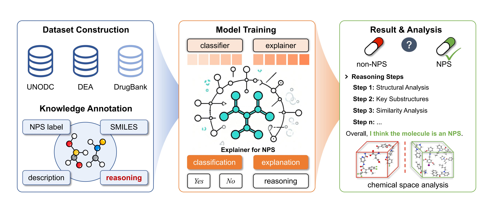

# NPS-EDR: Explainable Analysis for New Psychoactive Substance Identification with Chemical Insights
📰 **Publication Announcement**  
On October 28, 2025, the paper was published in the **Journal of Chemical Information and Modeling**.

   
The emergence of new psychoactive substances (NPS) poses a significant challenge to global public health due to their structural diversity and rapid evolution. Traditional detection methods, such as gas chromatography−mass spectrometry and liquid chromatography−mass spectrometry, which focus on component analysis and comparison with known molecules, lack adaptability for novel variants. In contrast, deep learning offers promise for proactive identification. We introduce NPS-EDR, an Explainable Deep Reasoning model for NPS identification. It features a two-stage prediction−explanation framework that enhances analysis and builds confidence. The architecture utilizes the strengths of cooperative training-mode-specific experts and reinforcement learning to ensure consistency between explanations and answers. Built on a chain-of-thought data set of over 2,900 NPS and drug molecules, NPS-EDR integrates chemical prior knowledge for precise structural−functional interpretation. Unlike detection, our model leverages biochemical insights to provide interpretable structural and functional analyses of potential NPS
molecules, achieving superior accuracy, precision, and transparency compared to mainstream large language models and biomolecular-specific chemical language models. Its transparent reasoning enhances public health strategies, pharmacological research, and forensic science, addressing the NPS crisis.

## Code Documentation
This section outlines the structure and purpose of the code repository for the NPS-EDR project.

1. **data/cot_data**  
   - **toy_nps_cot_data.xlsx**: Contains example data for the Chain-of-Thought (COT) dataset, including SMILES strings, NPS labels, and reasoning annotations for over 2,900 molecules. This file serves as a reference for dataset format and content.
   - For the full dataset, refer to https://zenodo.org/records/16778503; access is available upon request to the corresponding author for legitimate research purposes.
2. **src/datasets**  
   - Contains scripts for dataset construction and preprocessing.

3. **src/models**  
   - Includes code for building the NPS-EDR model, implementing the Cooperative Experts Framework with dual LoRA modules (classifier and explainer). The classifier performs binary NPS/non-NPS prediction, while the explainer generates chemically grounded reasoning, leveraging a Transformer-based architecture.

4. **src/utils**  
   - Provides utilities for reinforcement learning (RL) training, including reward functions for the REINFORCE algorithm (balancing answer accuracy, reasoning length, and diversity). Additional tools support SMILES processing, data visualization, and model evaluation.

5. **src/task_manager.py**  
   - Contains the main execution code for training and inference. It orchestrates the two-stage training process (Supervised Fine-Tuning and RL) and manages inference tasks, integrating classifier predictions with explainer reasoning for NPS identification and analysis.
